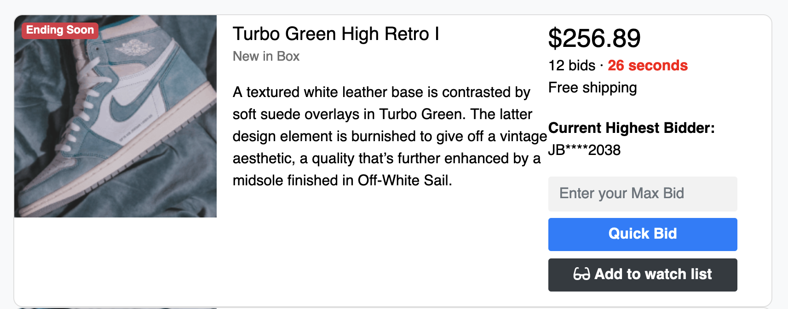
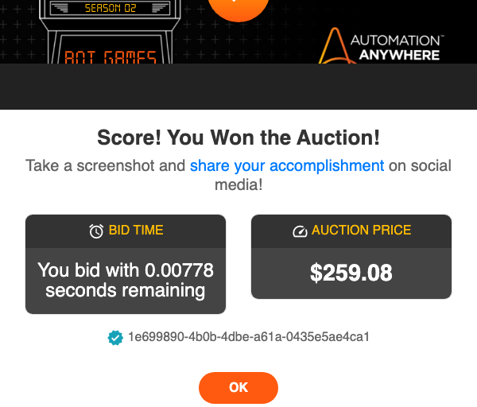

# Auction Sniper Challenge



This robot solves the [Auction Sniper Challenge](https://developer.automationanywhere.com/challenges/automationanywherelabs-auctionsniper.html).

> In this challenge, create a bot that is able to place a bid as close to 0 seconds left in the auction as possible to score the best deal! If your bid is placed with too much time left in the auction, you may find that you get outbid, or end up paying more than a bid that is placed right before the auction ends.

## The robot code

> Note: There is no one and only "correct" solution. This is just one example of how you _might_ use Robocorp to solve this challenge.

The robot uses the [RPA.Browser.Playwright](https://robocorp.com/docs/libraries/rpa-framework/rpa-browser-playwright) library for browser automation. And that's all we need in this challenge!

```robot
*** Settings ***
Documentation     Completes the Auction Sniper challenge.
Library           RPA.Browser.Playwright

*** Tasks ***
Complete the Auction Sniper challenge
    Open the auction website and accept cookies
    Prepare the bid
    Wait until the last moment
    Confirm the bid
    Take a screenshot of the result

*** Keywords ***
Open the auction website and accept cookies
    New Context    userAgent=Chrome/100.0.4896.75
    New Page
    ...    https://developer.automationanywhere.com/challenges/automationanywherelabs-auctionsniper.html
    Click    id=onetrust-accept-btn-handler

Wait until the last moment
    Wait For Elements State
    ...    id=time-left >> text="0 seconds"
    ...    timeout=0:00:59
    Sleep    0.961 seconds

Prepare the bid
    ${current_price}=    Get Text    id=auction-price
    Fill Text    id=ending-soonest-bid    ${{${current_price} + 3}}
    Click    id=auctionQuickBid

Confirm the bid
    Click    css=#bidConfirm .btn-success    force=True

Take a screenshot of the result
    Sleep    1 second
    Take Screenshot    selector=css=#myModal .modal-content
```

### Open the auction website and accept cookies

The robot opens a new headless browser and accepts the cookies.

### Prepare the bid

The robot checks the current highest bid and raises that by &dollar;3 but does not confirm the bid yet. The `${{ ... }}` syntax is used to evaluate a Python expression.

### Wait until the last moment

The [Wait For Elements State](https://robocorp.com/docs/libraries/rpa-framework/rpa-browser-playwright/keywords#wait-for-elements-state) keyword waits until it finds an element with the `id` of `time-left` and that contains the text `0 seconds`. The [RPA.Browser.Playwright](https://robocorp.com/docs/libraries/rpa-framework/rpa-browser-playwright) library supports chaining multiple selector strategies for maximum flexibility when targeting elements (CSS, XPath, text).

### Confirm the bid

The confirmation is completed by clicking a button.

### Take a screenshot of the result

Finally, the robot takes a screenshot of the result modal.


